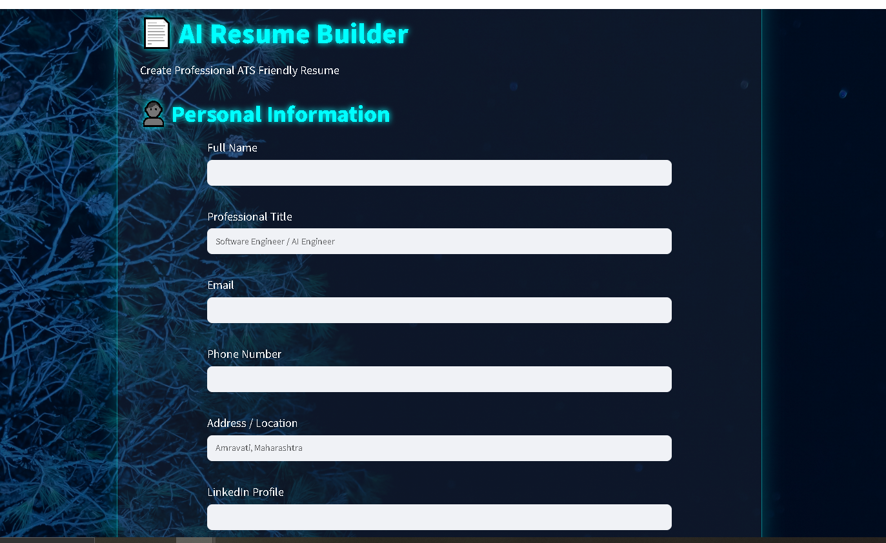
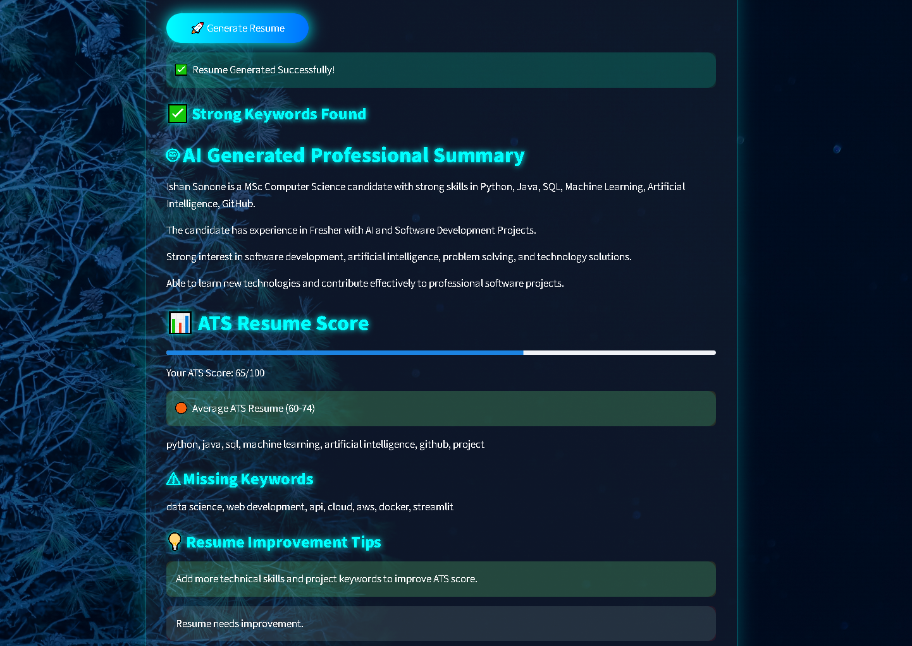
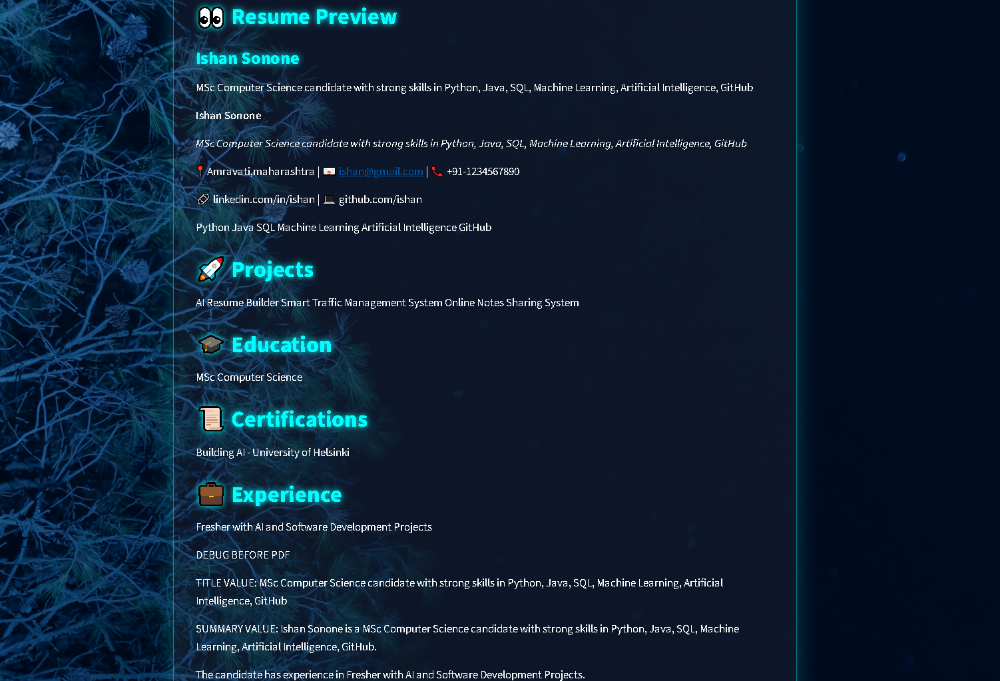

# 🤖 AI Resume Builder

## 🌐 Live Demo

🚀 Coming Soon (Deployment in Progress)

---

## 🎯 Project Highlights

⭐ AI-powered resume generation  
⭐ ATS compatibility analysis  
⭐ Keyword matching system  
⭐ Professional PDF resume export  
⭐ Modern Streamlit dashboard  
⭐ Recruiter-friendly resume formatting

<palign="center">

## 📌 Overview

**AI Resume Builder** is an AI-powered resume creation platform that helps users generate professional, ATS-friendly resumes.

The application uses Artificial Intelligence, keyword analysis, and modern resume formatting techniques to create recruiter-ready resumes.

It provides:

- AI-generated professional summaries
- ATS resume scoring
- Missing keyword analysis
- Resume improvement suggestions
- Professional PDF resume generation

---

# ✨ Key Features

## 🤖 AI Resume Summary Generator

Automatically generates professional career summaries based on:

- Skills
- Education
- Experience
- Projects

## 📊 ATS Resume Analyzer

Analyzes resume content and provides:

✅ ATS Score Percentage  
✅ Strong Keywords Detection  
✅ Missing Keywords  
✅ Resume Improvement Suggestions  

## 📄 Professional Resume Builder

Generate resumes with:

- Modern templates
- Professional formatting
- PDF export
- Recruiter-friendly structure

## 🎨 Premium User Interface

Features:

- AI futuristic design
- Glassmorphism UI
- Responsive layout
- Modern dashboard experience

---

# 🖥️ Application Screenshots

## 🏠 Home Interface

## 📊 ATS Score Analysis

## 📄 Resume Preview

